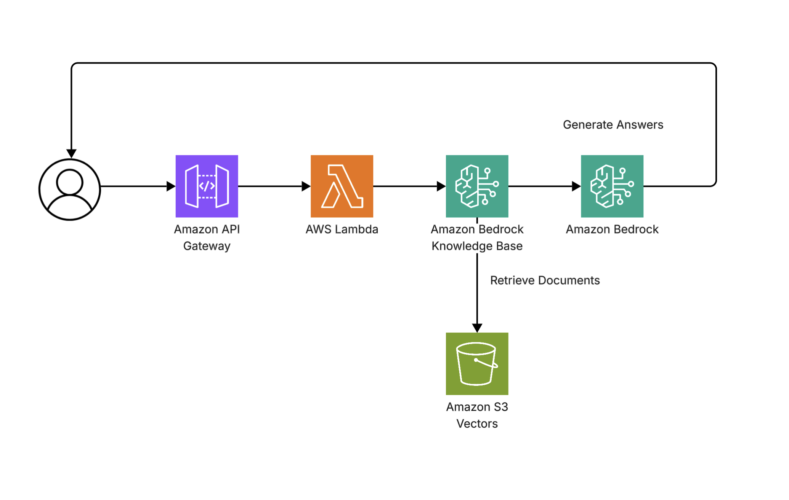

# RAG-Powered Knowledge System

RAG (Retrieval-Augmented Generation) application using Amazon Bedrock Knowledge Bases to retrieve relevant context and generate LLM responses.

## 🧠 How It Works

#### ▫️ Indexing / Ingestion phase

1. Document is uploaded to S3.
2. Text is split into smaller chunks.
3. Each chunk is converted into a vector using an embedding model.
4. Embeddings are indexed for similarity search.
5. Vectors are stored in S3 Vectors.

#### ▫️ Retrieval / Generation phase

1. User sends a query.
2. Query is converted into a vector using the same embedding model.
3. Vector similarity search is performed.
4. Relevant document chunks are retrieved.
5. Retrieved context is added into the LLM prompt.
6. LLM generates a response based on the retrieved context.

## 📄 Data

Custom Support Manual including:

- Order cancellation policies
- Refund policies
- Shipping timelines
- Customer support hours

## 🏗 Architecture

<p>
  
  <br />
  <sub>Architecture diagram created with Lucidchart</sub>
</p>

## 🚀 Features

- RAG based context retrieval for accurate responses.
- Configurable top-K retrieval for optimized results.
- Semantic search using vector embeddings.
- Real-time command status indicators. (green: success, red: error)
- Displays retrieval results, LLM responses, model details, metrics, and sources references.

## 💬 Example Queries

- "What is your refund policy?"
- "How long does shipping take?"
- "Can I cancel my order?"

## 🛠 Tech Stack

#### ▫️ Frontend

- React (Vite)
- Tailwind CSS

#### ▫️ Backend / AWS

- Amazon Bedrock
- Amazon Bedrock Knowledge Base
- AWS SAM
- AWS Lambda
- Amazon API Gateway
- Amazon S3 Vectors

> Note: AWS Lambda is managed via AWS SAM.

## 📦 Installation

Clone the repository and install dependencies.

```bash
git clone https://github.com/eobcre/bedrock-rag-project.git
cd bedrock-rag-project
npm install
```

**Environment Variables**

```
KNOWLEDGE_BASE_ID=your_knowledge_base_id
MODEL_ID=your_model_id
```

**Run Locally**

```
npm run dev
```

Note: This application requires a deployed AWS backend. (API Gateway, Lambda and Bedrock)
